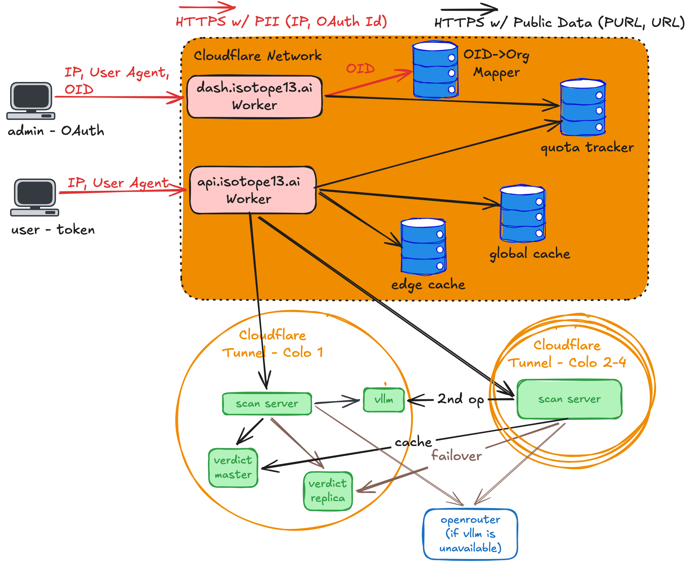

# API Architecture

Nothing that identifies a user reaches our servers. It leaves Cloudflare only for sign-in (GitHub, Google) and billing (Stripe).

## Components

**Cloudflare Workers:**

- `dash.isotope13.ai`: customer accounts. GitHub or Google sign-in; mints API tokens.
- `api.isotope13.ai`: is this PURL, URL, hash, or file hostile? A bearer token resolves to an org for quota.

**Cloudflare storage:**

- OID→Org mapper (Workers KV): OAuth IDs, orgs, tokens. Only dash reads identities.
- Quota tracker (Analytics Engine): request counts per org.
- Edge cache (Workers Cache) and global cache (Workers KV): verdicts.

**Scan servers** run in four US colos.

**Verdict master** stores artifacts on disk and verdicts in PostgreSQL, with a replica.

**vLLM** grades borderline results from the scanner's evidence, never the file or the caller. OpenRouter is the fallback.

## Data

| Data | Personal? | Where it goes |
| --- | --- | --- |
| IP address, user agent | Yes | Cloudflare edge only; never logged |
| OAuth subject identifier, username or email | Yes | dash and its KV; the sign-in provider |
| Name, email, address, card | Yes | Stripe |
| Org ID, request counts | No | Quota tracker |
| PURLs, URLs, hashes, files, verdicts | Rarely, inside a file; public | Caches, scan servers, verdict store |

## Trust boundaries

1. Internet → Cloudflare: TLS; OAuth for dash, bearer token for the API.
2. Cloudflare → colos, and colo → colo: Cloudflare Tunnel public hostnames, bearer token. No inbound ports.
3. Colos → OpenRouter: TLS, API key.
